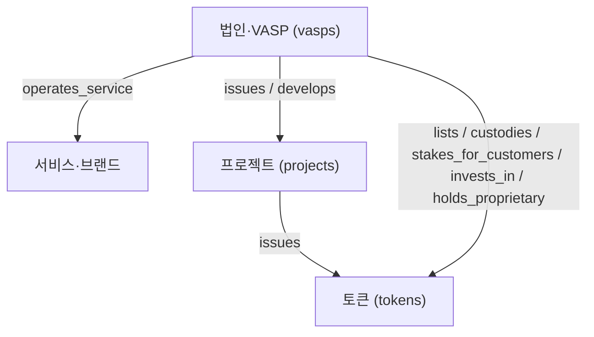

# 회사·서비스·프로젝트·토큰 분리 설계

> 2026-09-06 GPT 제안을 데이터 관점에서 정리한 것. 화면(뷰어·번역·질의)은 GPT 웹 프로젝트가 맡고,
> 이 폴더는 **그 화면이 읽을 데이터**만 만든다.

## 1. 객체 다섯 가지

| 객체 | 파일 | 무엇 | 예 |
|---|---|---|---|
| 회사(법인·VASP) | `vasps.json` | 법적 책임 주체. FIU 신고, DART 공시의 단위 | 두나무 주식회사 |
| 서비스·브랜드 | `vasps.json`의 `service_names`, `links[link_type=service_website]` | 회사가 운영하는 상품 | 업비트 |
| 프로젝트 | `projects.json` | 블록체인·프로토콜·토큰 발행 프로젝트. 백서의 주체 | 특정 L1, 스테이블코인 |
| 토큰 | `tokens.json` | 발행 주체·용도·권리 | 특정 스테이블코인 토큰 |
| 관계 | `relations.json` | 회사↔프로젝트↔토큰 사이의 방향 있는 관계 | 회사 A가 토큰 B를 **수탁**한다 |

관계는 반드시 `relation` 값으로 구분한다. "운영한다"와 "상장했다"를 같은 줄에 두지 않는다.
각 관계에는 `legal_responsibility_note`로 **이 관계에서 책임 주체가 누구인지**를 적는다. 이것이 이 사이트의 차별점이다.

## 2. 국내 VASP 현실에서 주의할 점

- 국내 거래소는 자체 발행 토큰을 상장할 수 없어(특금법) `issues` 관계는 거의 비어 있을 것이다. 비어 있는 것이 정상이며 억지로 채우지 않는다.
- 거래소 `lists` 관계는 수백 개다. **전부 넣지 않는다.** 감사·회계 쟁점과 연결되는 토큰(예: 고객 위탁 규모가 큰 것, 수탁·스테이킹 대상, 준비자산형 스테이블코인)만 넣고 그 이유를 `notes`에 쓴다.
- 보관관리업자(KODA·KDAC 등)의 `custodies` 관계, 거래소의 `stakes_for_customers` 관계가 목적 A에 가장 유용하다.
- 프로젝트 파일럿은 3~5개로 시작한다. 선정 기준은 "회계·감사 쟁점이 분명한가"이지 "유명한가"가 아니다.

## 3. 데이터 작업과 화면 작업의 경계

| GPT 제안 단계 | 데이터(이 폴더, Codex) | 화면(GPT 웹 프로젝트) |
|---|---|---|
| 1단계 링크 + 출처유형 + 확인일 | `vasps.json.links[]` 채우기 | 상세페이지 상단 링크 블록 |
| 2단계 프로젝트 페이지 | `projects.json`, `tokens.json`, `relations.json`, 백서 메타데이터(`whitepapers[]`) | 프로젝트 상세페이지 |
| 3단계 "백서 읽기 전에" | 아직 안 함. 10개 질문의 답을 쓰려면 백서를 읽는 사람이 필요. 초기에는 GPT가 화면에서 작성 | 질문·상태·원문 위치 표시 |
| 4단계 원문·번역 병렬 뷰어 | **하지 않음.** 백서 전문 저장·번역은 저작권·이용조건 검토가 먼저 | 뷰어 |
| 5단계 백서 질의 | 하지 않음 | AI 기능 |

## 4. 백서 취급 원칙

- 기본은 `storage_policy: link_only`. 원본 URL·버전·발행일·`retrieved_at`·`sha256`만 기록한다.
- 해시는 버전 변경 감지용이다. 같은 URL의 파일이 바뀌면 새 `whitepapers[]` 항목을 추가하고 이전 항목은 남긴다.
- 전문 저장은 이용조건을 확인해 `license_or_terms`에 적은 경우에만 `public_with_permission`.
- 번역본은 만들지 않는다. 필요하면 나중에 문단 단위로, 비공식 번역임을 표시해서.

## 5. 세 가지 문장의 구분

화면과 데이터 모두에서 다음 셋을 섞지 않는다.

| 종류 | 데이터에서 표시 |
|---|---|
| 백서·회사의 주장 | `summary_status: from_whitepaper`, `holder_rights_per_whitepaper`, `status: fact`(출처가 그 문서) |
| 사이트의 분석 | `summary_status: site_analysis`, `status: inference`, `analytical_inference` |
| 확인되지 않음 | `unverified`, `null`, `needs-review.json` |
